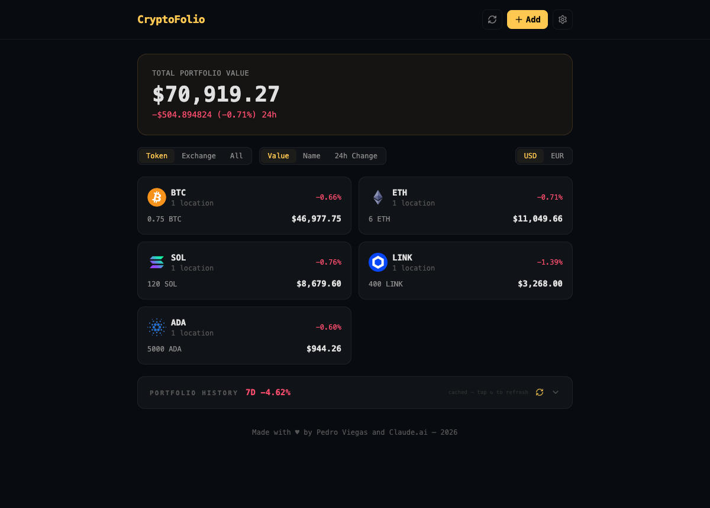

# CryptoFolio

A privacy-first crypto portfolio tracker with a dark, terminal-inspired aesthetic.
Track holdings across multiple exchanges, see live prices in USD and EUR, and explore a
historical value chart — all stored **on your device**, no account, no backend database.

> **Live data** comes from [CoinGecko's](https://www.coingecko.com/en/api) free API,
> proxied through a small serverless function that adds caching and rate-limit protection.
> Your holdings never leave the browser (`localStorage`).




---

## Features

- **Live prices** in USD and EUR with 24h change, from CoinGecko.
- **Holdings management** — add, edit, and remove holdings by token, amount, and exchange.
- **Multi-exchange** — assign holdings to 13 supported exchanges (with real favicons).
- **Grouping & sorting** — group by Token / Exchange / All; sort by Value / Name / 24h.
- **Historical chart** — portfolio value over 7D / 1M / 1Y / 5Y (Recharts), with cached,
  rate-limit-aware data fetching.
- **Import / export** your portfolio as JSON, and a guarded **delete-all** factory reset.
- **Adaptive theme** — Dark / Light / System, with a gold (`#ffc850`) accent throughout.
- **Offline-friendly persistence** — everything lives in `localStorage`.

## Tech stack

| Area | Choice |
|---|---|
| Framework | React 19 + TypeScript |
| Build | Vite 8 |
| Styling | Tailwind CSS 3 |
| State | Zustand (with `persist`) |
| Charts | Recharts |
| Routing | React Router 8 |
| API proxy | Cloudflare Pages Functions (Workers) — see [AWS alternative](#deployment) |
| Tests | Vitest + Testing Library |

## Getting started

The web app lives in [`cryptofolio-web/`](cryptofolio-web).

```bash
cd cryptofolio-web
npm install

npm run dev       # full app + /api proxy on one origin (live prices), port 8788
npm run dev:ui    # Vite only — fast HMR for pure UI work (/api calls 404 here)
npm test          # run the Vitest suite
npm run build     # type-check + production build to dist/
```

## Deployment

CryptoFolio is a static SPA plus three `/api/*` proxy endpoints. Two supported targets:

- **Cloudflare Pages** (current): `npx wrangler pages deploy dist` — see
  [`cryptofolio-web/README.md`](cryptofolio-web/README.md).
- **AWS free tier** (S3 + CloudFront + Lambda): a full step-by-step guide with both a
  console walkthrough and an infrastructure-as-code (SAM) template lives in
  [`cryptofolio-web/DEPLOY_AWS.md`](cryptofolio-web/DEPLOY_AWS.md).

## Project structure

```
CryptoFolio/
├── README.md                 # you are here
├── LICENSE                   # MIT
├── CLAUDE.md                 # project brief for Claude Code sessions
└── cryptofolio-web/          # the web app
    ├── src/                  # React app (components, store, lib, routes)
    ├── functions/api/        # Cloudflare Pages Functions — CoinGecko proxy
    ├── infra/                # AWS deployment: Lambda handler + SAM template
    ├── DEPLOY_AWS.md         # AWS free-tier deployment guide
    └── README.md             # web-app dev notes
```

## How the price proxy works

The frontend never calls CoinGecko directly. It calls same-origin `/api/prices`,
`/api/images`, and `/api/history/{id}`, which are handled by a small proxy that:

- **caches** responses at the edge for a per-endpoint TTL (prices 60s, history 10min–24h,
  images 24h), shielding CoinGecko's strict free-tier rate limit;
- **keeps the last known value** and serves it if CoinGecko returns `429`, so the UI never
  blanks out when rate-limited.

The same logic ships for both Cloudflare (`functions/api/`) and AWS (`infra/lambda/`).

## License

[MIT](LICENSE) © 2026 Pedro Viegas

Built with ♥ by Pedro Viegas and Claude.
